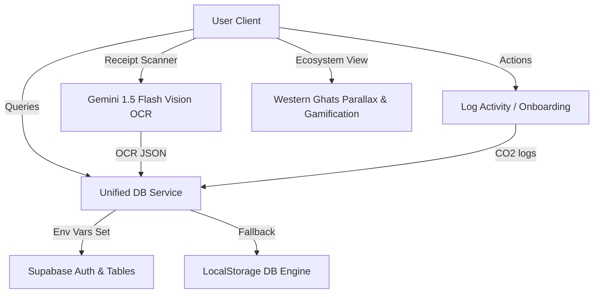

# Architectural Overview - Prakriti

Prakriti is designed as a Next.js 14 Web Application that supports both cloud (Supabase) data persistence and a fully featured local database simulation for testing/evaluation.

## 1. Unified Data Layer (`src/core/supabase.ts`)
The `dbService` exposes standard CRUD APIs matching the Supabase schema:
- `getUser(userId: string)`
- `saveUser(userData: User)`
- `getWeeklyBudget(userId: string, weekOf: string)`
- `saveWeeklyBudget(budget: WeeklyBudget)`
- `getDailyLogs(userId: string)`
- `addDailyLog(log: DailyLog)`
- `getIntentions(userId: string)`
- `addIntention(intention: Intention)`
- `toggleIntention(intentionId: string, active: boolean)`
- `getAdventures(userId: string)`
- `startAdventure(userId: string, startedAt: string, returnsAt: string, reward: number)`
- `completeAdventure(adventureId: string)`

If `NEXT_PUBLIC_SUPABASE_URL` and `NEXT_PUBLIC_SUPABASE_ANON_KEY` are not set, `dbService` will read and write to `localStorage` under specific key names matching the schema (e.g. `prakriti_users`, `prakriti_daily_logs`), simulating latency and DB constraints.

## 2. Receipt Scanning Pipeline (`src/app/api/scan/route.ts`)
- Camera or file upload retrieves a Base64-encoded image or files.
- Serves API route `/api/scan` on the Next.js backend, keeping the API Key secure.
- Calls Gemini 1.5 Flash API with the system-specific prompt and returns structured JSON conforming to the requested schema.
- Client parses result, presents a confirmation list with individual entries and a total, and logs it under the appropriate envelope.

## 3. Western Ghats Ecosystem Engine (`src/app/ecosystem/page.tsx`)
- Pure CSS parallax effect using layered absolute DIVs container matching different scroll speed layers.
- SVG Lion-Tailed Macaque with scale/translate animation for breathing and active adventures.
- Adventure timers managed in Supabase/LocalStorage: tracks `started_at` and `returns_at`. A circular countdown component shows the remaining time. Once expired, resolves and grants "Rainbow Pebbles".
